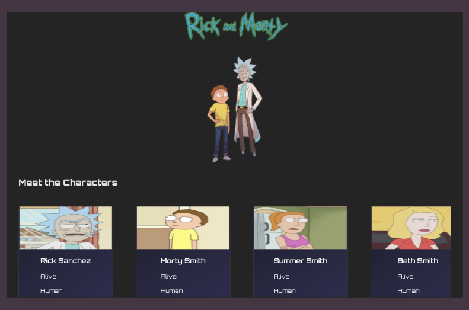
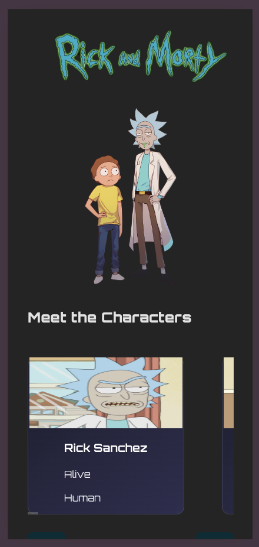
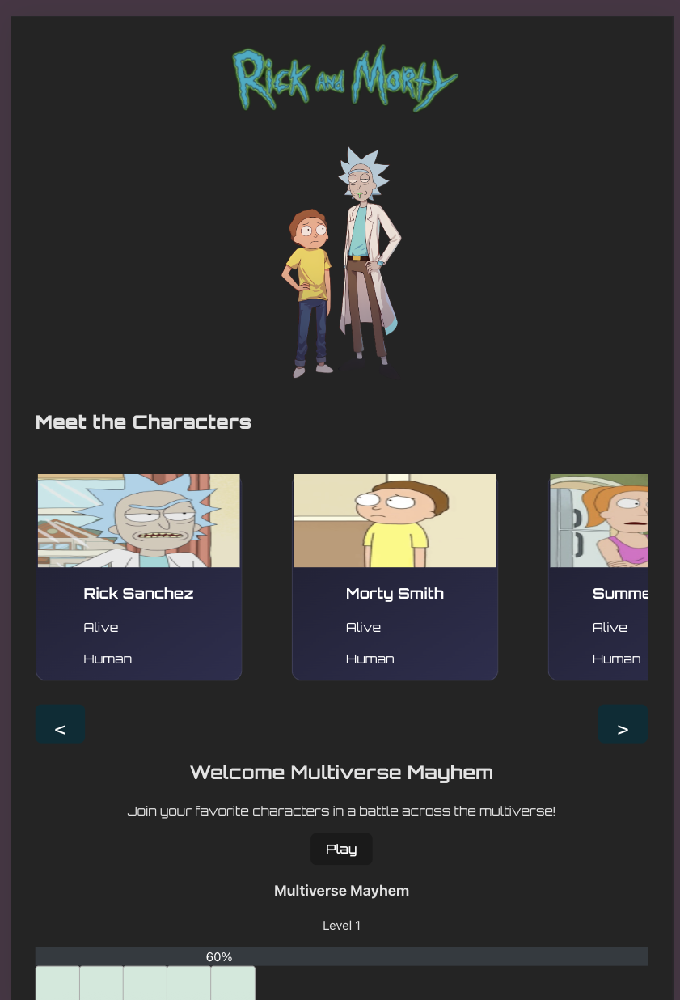

# 🛸 Rick and Morty Fan Page

A responsive and animated fan page for Rick and Morty built with React and React-Bootstrap. Explore character cards, animations, and an interactive mini-game called **Multiverse Mayhem**!

## 📸 Screenshot

### 🖥️ Desktop View



### 🖥️ Mobile View



### 🖥️ Tablet View



---

## 👾 Features

- 🔍 Browse Rick and Morty characters with slick cards
- 🔄 Carousel-style navigation to view more characters
- 🎮 "Multiverse Mayhem" mini-game with a level-up experience
- 🎨 Styled with **React-Bootstrap** and **Google Fonts**
- ✨ Enhanced visuals using **Animate.css**
- 🔀 Client-side routing with **React Router v7**

---

## 💻 Technologies Used

- **React** – Component-based UI development
- **React-Bootstrap** – Pre-styled responsive components
- **React Router DOM** – Client-side navigation
- **Animate.css** – Easy-to-use CSS animations
- **Google Fonts** – Custom typography

---

## 📂 Getting Started

To run the project locally:

```bash
git clone https://github.com/Mayowa-Dimeji/rick_morty_fanpage.git
cd rick_morty_fanpage
npm install
npm start
```
